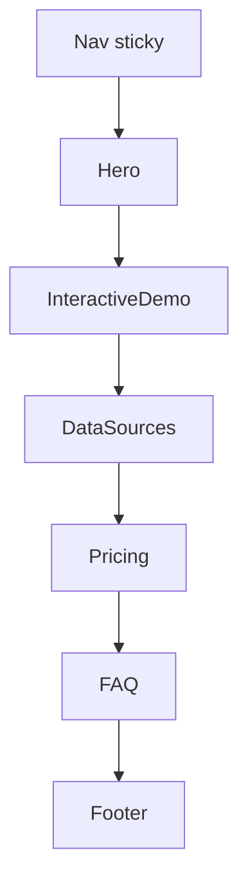

# L3 Templates — ideacheck

> 對齊 `03_templates_spec.md` landing-page template category
> 來源：https://ideacheck.cc/（RSC payload 確認 section 順序）
> 日期：2026-04-08

---

## Template: `landing-ai-validator`

- **Route**: `/`
- **Category**: Single-page marketing landing
- **Section count**: 7（1 nav + 5 body + 1 footer）
- **Confirmed order**（從 RSC payload）：Nav → Hero → InteractiveDemo → DataSources → Pricing → FAQ → Footer
- **Sticky elements**: 頂部 Nav
- **Anchored navigation**: 是，nav 中央連結對應 body section 的 anchor id

### 區塊組成（由上到下）

### 1. Nav (sticky header)

- **目的**：品牌曝光 + 章節導航 + 語言切換 + 登入入口
- **結構骨架**：
  - Left：Logo（品牌標記）
  - Center：4 個錨點連結（服務 / 數據來源 / 價格 / FAQ）
  - Right：LanguageSwitcher + 登入按鈕
- **Tokens consumed**（自 L0）：
  - Spacing：container padding-x、nav height
  - Typography：nav link size（sm/base）、weight medium
  - Color：surface background、border-bottom
- **Anchor id**：N/A（自身為導航器）
- **Confidence**：HIGH（從 static HTML 可確認）

### 2. Hero

- **目的**：價值主張 + 主要 CTA 引導進入互動 demo
- **結構骨架**：
  - Header：headline（meta title 暗示「你的點子能活多久？」）
  - Body：subcopy（meta description，HIGH confidence）
  - CTA：primary button → 滑動或聚焦至 InteractiveDemo
- **Tokens consumed**：
  - Spacing：section padding-y（XL）、container max-width
  - Typography：display heading scale、body lead size
  - Color：text primary、brand accent
- **Anchor id**：`#hero` 或 top（推測）
- **Confidence**：LOW（內部 copy 為 client-rendered；僅 meta description 為 HIGH）

### 3. InteractiveDemo（服務）

- **目的**：核心互動體驗 — 讓使用者立即試用 AI 評分
- **結構骨架**：
  - Header：section heading + 簡短說明
  - Body：idea-input textarea（多行輸入框）
  - CTA：「打分」按鈕
  - Result：7 個面向的評分卡片或 radar chart（推測）
- **Tokens consumed**：
  - Spacing：form field gap、card padding
  - Typography：form label、result heading
  - Color：input border、focus ring、score color scale
- **Anchor id**：`#service`（對應 nav「服務」連結，推測）
- **Confidence**：LOW（client-rendered，結構為合理推測）

### 4. DataSources（數據來源）

- **目的**：信任建立 — 揭露 AI 評分依據的資料來源
- **結構骨架**：
  - Header：section heading「數據來源」
  - Body：來源 logo grid 或條列卡片（推測）
- **Tokens consumed**：
  - Spacing：grid gap、section padding
  - Typography：caption、source name
  - Color：muted background、divider
- **Anchor id**：`#data-sources`（推測）
- **Confidence**：LOW（client-rendered）

### 5. Pricing（價格）

- **目的**：商業轉換 — 呈現方案分層
- **結構骨架**：
  - Header：section heading + 副標
  - Body：tier cards（free / paid，推測 2-3 階）
  - CTA：每張卡片獨立 CTA 按鈕
- **Tokens consumed**：
  - Spacing：card padding、tier gap
  - Typography：price display、feature list
  - Color：highlighted tier accent、border
- **Anchor id**：`#pricing`（推測）
- **Confidence**：LOW（client-rendered）

### 6. FAQ

- **目的**：解答疑慮、降低轉換摩擦
- **結構骨架**：
  - Header：section heading「FAQ」
  - Body：accordion / collapsible question list（推測）
- **Tokens consumed**：
  - Spacing：item padding、accordion gap
  - Typography：question weight、answer line-height
  - Color：divider、expand icon
- **Anchor id**：`#faq`（推測）
- **Confidence**：LOW（client-rendered）

### 7. Footer

- **目的**：次要導航、法律連結、品牌收尾
- **結構骨架**：
  - Brand：logo + 簡短描述
  - Links：7 個 footer 連結（服務 / 數據來源 / 價格 / FAQ / 聯絡我們 / 隱私權政策 / 服務條款）
  - Copyright：© 2026
- **Tokens consumed**：
  - Spacing：footer padding-y、link gap
  - Typography：footer link size sm、muted color
  - Color：footer surface、muted text
- **Anchor id**：N/A
- **Confidence**：HIGH（從 static HTML 可確認）

---

## Layout 規則

- **Container max-width**：TBD（推測 1200-1280px，與 03_templates_spec.md 預設一致）
- **Section vertical spacing**：TBD（client-rendered）
- **Divider 使用**：TBD；nav 與 footer 推測有 border separator
- **Anchored scroll**：所有 body section 應有 scroll-margin-top 偏移以避開 sticky nav

## Responsive

- **Mobile**：TBD — nav 中央連結預期 collapse 為漢堡選單
- **Tablet**：TBD
- **Desktop**：HIGH — 觀察到的 nav 為桌面版佈局（logo / center links / right actions）

---

## Copy we observed

| 區塊 | 內容 | 來源 | Confidence |
| :--- | :--- | :--- | :--- |
| Hero subcopy | 「輸入你的產品點子，AI 從 7 個面向打分數，告訴你這個點子會怎麼死。」 | `<meta name="description">` | HIGH |
| Hero headline（推測）| 「你的點子能活多久？」 | `<title>` 暗示 | MEDIUM |
| Nav links | 服務 / 數據來源 / 價格 / FAQ | static HTML | HIGH |
| Footer links | 服務 / 數據來源 / 價格 / FAQ / 聯絡我們 / 隱私權政策 / 服務條款 | static HTML | HIGH |
| Footer copyright | © 2026 | static HTML | HIGH |

其他章節（InteractiveDemo / DataSources / Pricing / FAQ）內部 copy **TBD — client-rendered，未在 static HTML 中**。需要後續以 headless browser 抓取或人工觀察補齊。

---

## 結構圖

---

## Template 重用性與變體

- 這是一個**單頁行銷 landing**，7 個錨點章節 + sticky top nav。
- Pattern 對應 `03_templates_spec.md` 的 **landing-page template** category。
- **Variant 觀察**：`shipyouridea.today` 使用相同 template 但**少一個 DataSources section**（4 個 body sections，而非 5）。可視為同一 template 的精簡變體。
- 可重用骨架：Nav → Hero → [Interactive/Feature blocks ×N] → Pricing → FAQ → Footer

---

## 待補（後續 pass）

- [ ] 使用 headless browser（Playwright/Puppeteer）抓取 hydrated DOM，補齊 Hero / Demo / DataSources / Pricing / FAQ 內部 copy 與結構
- [ ] 量測實際 section padding、container max-width、breakpoint 行為
- [ ] 驗證錨點 id 命名與 nav href 對應關係
- [ ] 補 mobile / tablet 版佈局（漢堡選單、堆疊方向）
