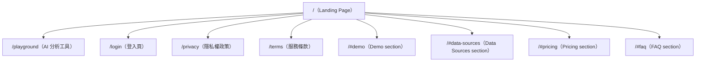

# L4 Sitemap — ideacheck.cc

---

## 頁面層級

---

## 頁面清單

| Path | 類型 | 主要功能 | 對應 Template |
|------|------|---------|--------------|
| `/` | Landing | 產品介紹 + CTA + 信任建立 | SaaS Landing（Scroll）|
| `/playground` | App | AI 點子驗證分析器（核心功能） | App Tool |
| `/login` | Auth | 登入 / 訂閱管理 | Auth |
| `/privacy` | Legal | 隱私權政策 | Doc |
| `/terms` | Legal | 服務條款 | Doc |

**備注**：`#data-sources` 為 Landing 頁獨立 section（非獨立路由），但在 nav 有直接連結 → 資料透明度是核心訴求。

---

## 導航結構

### 主選單（Nav）
- 服務 → `/#demo`
- 數據來源 → `/#data-sources`（★ 比 ShipYourIdea 多，強調信任）
- Pricing → `/#pricing`
- FAQ → `/#faq`
- Login → `/login`（按鈕）

### Footer（7 links）
- 服務 → `#demo`
- 數據來源 → `#data-sources`
- 價格 → `#pricing`
- FAQ → `#faq`
- 聯絡我們 → `mailto:service@ideacheck.cc`
- 隱私權政策 → `/privacy`
- 服務條款 → `/terms`

---

## 對應原型推測

> 對應 `references/website_recipes.md` 的哪個原型？

- **主要**：SaaS AI Tool Landing with Data Credibility Layer
- **次要**：Freemium SaaS with Aggressive Anchor Pricing（$3.29/mo）

**特徵**：
- 同樣極簡路由結構（5 頁）
- Landing 頁比 ShipYourIdea 多一個「資料信任」section
- 付費方案直接可購買（vs ShipYourIdea 的 Coming Soon）
- `/playground` 核心功能頁（有月限制的 free tier）
- 無 Dashboard（早期 MVP）

**vs ShipYourIdea 路由差異**：
- 無差異（路由結構完全相同，均為 5 頁）
- 差異在 Landing 頁的 section 數量（5 vs 4）
