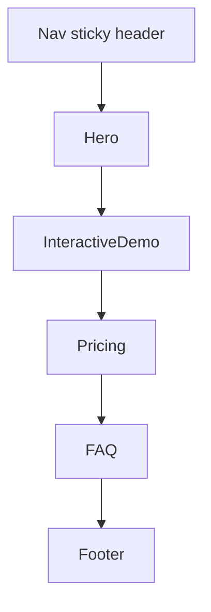

# L3 Templates — shipyouridea

> 對齊 `03_templates_spec.md` 結構
> Source: https://shipyouridea.today/ (RSC payload + static HTML)

---

## Template: `landing-ai-validator-lite`

- **Route**: `/`
- **Section order (RSC payload)**: `Hero` → `InteractiveDemo` → `Pricing` → `FAQ`
- **Notable absences**: 無 `DataSources`、無顯式 section separator 元件
- **Reuse**: Matches `landing-page` template in `03_templates_spec.md`. Reusable as-is; swap copy + brand.

### Layout 規則（觀察值 + 推測）

- Container max-width：TBD（推測 1200px，承襲 L2 layout patterns）
- Section vertical spacing：TBD（從 RSC 看不出來，需 runtime DOM 量測）
- Divider 使用：未觀察到明顯 divider，section 之間靠 spacing 區隔

### Responsive

- Mobile / Tablet / Desktop：TBD（內容於 client-side 注入，靜態 HTML 無法觀察 breakpoint 行為）

### 結構圖

---

## Sections（依出現順序）

### Nav (sticky header)

- **Anchor id**: `#nav`
- **Confidence**: HIGH
- **Purpose**: 全站導覽與品牌曝光，CTA 入口（登入）
- **Structural skeleton**:
  - Logo（36px height）
  - Center links × 3：`範例` / `價格` / `FAQ`
  - Right cluster：`LanguageSwitcher` + Login button
- **Expected tokens (from L0)**: `color.surface.nav`, `space.nav.x`, `radius.button.sm`, `font.body.sm`
- **Notes**: sticky 行為與 ideacheck 一致

### Hero

- **Anchor id**: `#hero`
- **Confidence**: LOW（內部結構） / HIGH（meta-derived copy）
- **Purpose**: 頭版價值主張 + 引導使用者進入 demo
- **Structural skeleton**:
  - Headline (h1)
  - Sub-copy (paragraph)
  - Primary CTA（推測為 scroll-to-demo 或 demo-input focus）
- **Expected tokens (from L0)**: `font.display.xl`, `font.body.lg`, `color.text.primary`, `color.brand.primary`, `space.section.y`
- **Copy we observed**:
  - Headline (from `<title>`): `你的點子能活多久？`
  - Sub-copy (from `meta[name=description]`): `輸入你的產品點子，AI 從 7 個面向打分數，告訴你這個點子會怎麼死。`
  - 兩段 meta 字串為 HIGH confidence；確認 meta description 直接作為 Hero subcopy 使用。

### InteractiveDemo

- **Anchor id**: `#demo`
- **Confidence**: LOW
- **Purpose**: 將「7 面向 AI 打分」具象化為可玩的試用體驗，作為主要轉換手段
- **Structural skeleton**（推測）:
  - Idea input（textarea + submit）
  - Scoring display（7 維度的分數卡 / radar / list）
  - 結果頁可能附 CTA（註冊以儲存結果）
- **Expected tokens (from L0)**: `color.surface.card`, `radius.card.lg`, `shadow.card.md`, `font.mono.sm`（分數）
- **Notes**: 內容由 client-side 注入，靜態 HTML 無細節

### Pricing

- **Anchor id**: `#pricing`
- **Confidence**: LOW
- **Purpose**: 呈現付費方案，將 demo 體驗者轉為付費用戶
- **Structural skeleton**（推測）: tier card grid（2-3 個方案，含價格、feature list、CTA）
- **Expected tokens (from L0)**: `color.surface.card`, `radius.card.lg`, `font.display.md`（價格數字）, `color.brand.primary`（推薦方案高亮）

### FAQ

- **Anchor id**: `#faq`
- **Confidence**: LOW
- **Purpose**: 處理購買前的最後疑慮，降低轉換阻力
- **Structural skeleton**（推測）: accordion list（question / answer 對）
- **Expected tokens (from L0)**: `color.divider.subtle`, `font.body.md`, `space.list.gap`

### Footer

- **Anchor id**: `#footer`
- **Confidence**: HIGH
- **Purpose**: 法律 / 聯絡 / 次要導覽
- **Structural skeleton**:
  - Logo（32px height）
  - Links × 5：`價格` / `FAQ` / `聯絡我們` / `隱私權政策` / `服務條款`
  - Copyright：`© 2026 ShipYourIdea`
- **Expected tokens (from L0)**: `color.surface.footer`, `color.text.muted`, `font.body.sm`, `space.footer.y`

---

## Key delta vs `ideacheck`

shipyouridea 的 landing 是 ideacheck 的 **leaner variant**：

| 維度 | ideacheck | shipyouridea |
| :--- | :--- | :--- |
| Body sections | 5 | **4** |
| `DataSources` 元件 | ✅ 有 | ❌ 無 |
| 結構順序 | Hero → InteractiveDemo → DataSources → Pricing → FAQ | Hero → InteractiveDemo → Pricing → FAQ |

**Hypothesis**: 同一個創辦人在 A/B 測試兩種信任建構策略——
- **ideacheck**：以 `DataSources` 顯式背書（trust via authority）
- **shipyouridea**：直接讓 demo 自證價值（trust via demo-first conversion）

目標都是極大化 signup rate，但走的路徑不同。後續若能拿到兩站轉換數據，可回頭驗證哪個策略勝出。

## Template reusability

此模板對應 `03_templates_spec.md` 的 `landing-page` template，**可直接重用**：
- 抽換 copy（headline、sub-copy、pricing tier、FAQ 內容）
- 抽換 brand tokens（color、logo、font）
- 結構骨架（Nav / Hero / InteractiveDemo / Pricing / FAQ / Footer）無需更動

對應到 generic 模板時，`InteractiveDemo` 槽位可被任意 `Showcase` 元件替代（影片、互動圖、計算器皆可）。

---

## E2E observation summary

- 靜態 HTML 中以下 component 名稱可被觀察到：`Hero`、`InteractiveDemo`、`Pricing`、`FAQ`
- `DataSources` 在靜態 HTML 中**未出現**（confirms 為 ideacheck 的 lean variant）
- Hero / Demo / Pricing / FAQ 的內部 DOM 內容**不在靜態 HTML**中，由 client-side 渲染；要拿到細節需 runtime DOM snapshot
