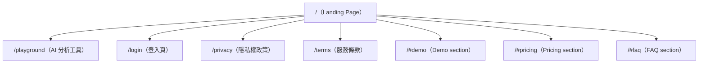

# L4 Sitemap — shipyouridea.today

---

## 頁面層級

---

## 頁面清單

| Path | 類型 | 主要功能 | 對應 Template |
|------|------|---------|--------------|
| `/` | Landing | 產品介紹 + CTA 引流 | SaaS Landing（Scroll）|
| `/playground` | App | AI 行動指南生成器（核心功能） | App Tool |
| `/login` | Auth | 登入 / 註冊 | Auth |
| `/privacy` | Legal | 隱私權政策 | Doc |
| `/terms` | Legal | 服務條款 | Doc |

**備注**：所有 section（#demo, #pricing, #faq）為單頁 hash anchor，非獨立路由。

---

## 導航結構

### 主選單（Nav）
- Demo → `/#demo`
- Pricing → `/#pricing`
- FAQ → `/#faq`
- ~~Login~~ → `/login`（按鈕，非文字連結）

### Footer
- 價格 → `#pricing`
- FAQ → `#faq`
- 聯絡我們 → `mailto:service@shipyouridea.today`
- 隱私權政策 → `/privacy`
- 服務條款 → `/terms`

---

## 對應原型推測

> 對應 `references/website_recipes.md` 的哪個原型？

- **主要**：SaaS AI Tool Landing（單頁行銷 + 工具進入點）
- **次要**：Freemium SaaS with Waitlist（主力 free 方案 + Coming Soon 付費計畫）

**特徵**：
- 極簡路由結構（5 頁）
- Landing 頁做所有行銷工作
- `/playground` 是唯一功能頁（無需登入即可使用）
- 無 Dashboard、無設定頁（早期 MVP 特徵）
