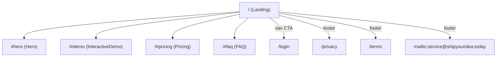

# L4 Sitemap — ShipYourIdea

- **Source**: https://shipyouridea.today/
- **Capture date**: 2026-04-08
- **Confidence**: HIGH (routes observed in static HTML nav + footer)

## Route Map

## Route Categorization

| Page | Public/Auth | Purpose | Observed from |
| :--- | :--- | :--- | :--- |
| `/` | Public | Marketing landing (Hero, InteractiveDemo, Pricing, FAQ) | Server-rendered HTML root |
| `/#demo` | Public anchor | Jump to interactive demo section | Top nav link |
| `/#pricing` | Public anchor | Jump to pricing section | Top nav + footer link |
| `/#faq` | Public anchor | Jump to FAQ section | Top nav + footer link |
| `/login` | Auth entry | Login page (CTA button target) | Top nav button |
| `/privacy` | Public | Privacy policy | Footer link |
| `/terms` | Public | Terms of service | Footer link |
| `mailto:service@shipyouridea.today` | Public | Contact email | Footer link |

## Functional Zoning

- **Marketing**: `/` (single-page with Hero / InteractiveDemo / Pricing / FAQ sections)
- **Legal**: `/privacy`, `/terms`
- **Auth**: `/login`
- **Contact**: `mailto:service@shipyouridea.today`

## Notes

- `<meta name="robots" content="noindex">` is present in the static HTML — site requests search engines not to index.
- Single-page marketing architecture; no blog, docs, or changelog routes observed.
- No `#data-sources` anchor exists on this site.
- Contact uses `mailto:` on the site's own domain.

## Delta vs ideacheck.cc

Same route structure as ideacheck.cc minus the `#data-sources` anchor. Sitemap footprint is 1 anchor smaller. TLD also different (`.today` vs `.cc`). Contact email on own domain.
